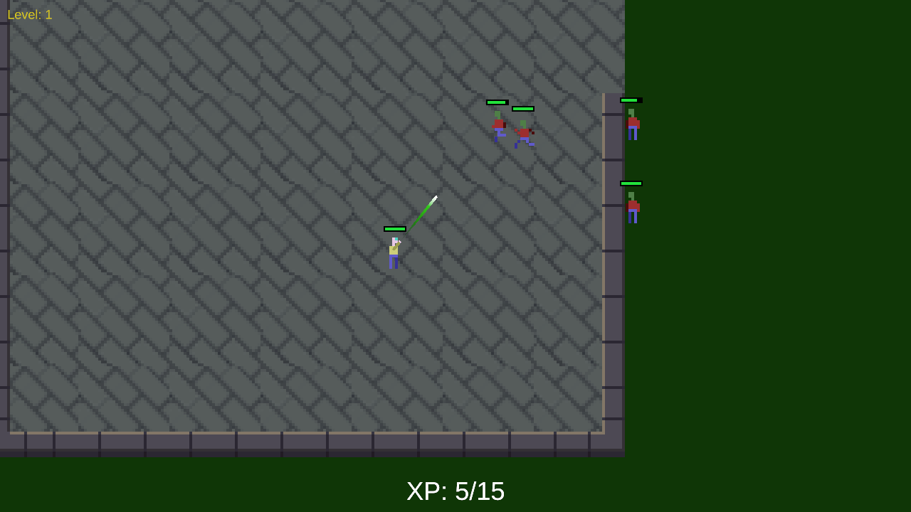

# WYZARD SURVIVORS

Test project that uses OkapiKit, a no-code framework developed for educational purposes at Lusofona University.

It's a ripoff of Vampire Survivors and the objective is to demonstrate the functionality of [Okapi Kit] on workshops.

Any suggestions of things that might be covered in the future are welcome!
If you want to do make improvements yourself, let me know what's the results after!

## Licenses

- Bunny assets by [TinyWorlds], licensed through the [CC0] license.
- All remaining game source code by Diogo de Andrade is licensed under the [MIT] license.

## Metadata

- Autor: [Diogo Andrade]

[Diogo Andrade]:https://github.com/DiogoDeAndrade
[CC0]:https://creativecommons.org/publicdomain/zero/1.0/
[CC-BY 3.0]:https://creativecommons.org/licenses/by/3.0/
[CC-BY-SA 4.0]:http://creativecommons.org/licenses/by-sa/4.0/
[MIT]:LICENSE
[OkapiKit]:https://github.com/VideojogosLusofona/OkapiKit
[TinyWorlds]:https://opengameart.org/users/tinyworlds

